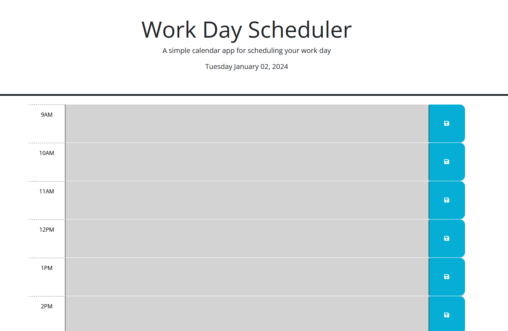

# <work-day-scheduler>

## Description

This project aimed to create a work day scheduler using JavaScript. The project provided the user with an hourly breakdown of the day (9 am - 5 pm) where they could enter tasks for each hour and save them for future reference. The page also displayed the date for that day and a color coded hourly breakdown that highlighted past, present, and future hours.

This project highlighted the use of third party apis to dynamicly display information on the page, in this case day.JS. day.JS was used to display the date at the top of the page as well as provide the hour reference from which the hourly user input boxes were then color coded. Local storage was once again used to save user input when the save button was pressed and be displayed on the page following refreshes. Finally DOM traversal was used to select the text input to be saved to local storage when a save button was pressed.

## Usage

A deployed version of the project can be found at https://mgberrysd.github.io/work-day-scheduler/

When loaded the page should appear as:

## Credits

The JS for the workday scheduler was created by Michael Berry.